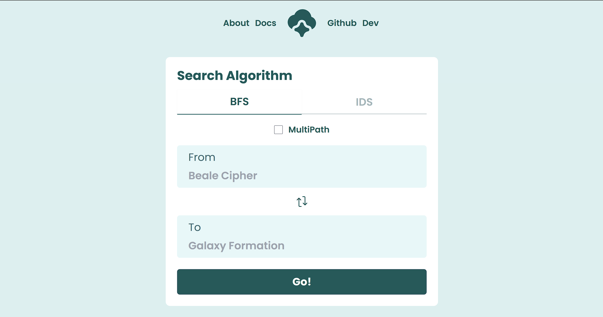
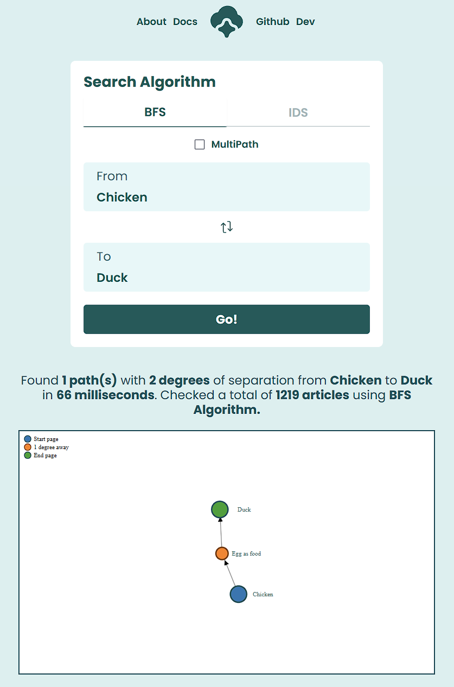

<h1 align="center">Tugas Besar 2 IF2211 Strategy Algorithm</h1>
<h1 align="center">Semester II Tahun 2023/2024</h1>
<h1 align="center">Utilization of IDS Algorithm and BFS in the WikiRace Game</h1>

- [Overview](#overview)
- [Abstraction](#abstraction)
- [Built With](#built-with)
- [Installation With Docker](#installation-with-docker)
- [Documentation](#documentation)

## Overview

<h1>Kelompok 26: GoPat</h1>

| NIM      | Nama               | Kelas |
| -------- | ------------------ | ----- |
| 13522021 | Filbert            | K-01  |
| 13522111 | Ivan Hendrawan Tan | K-01  |
| 13522117 | Mesach Harmasendro | K-01  |

<p>Our Lecturer : Dr. Ir. Rinaldi Munir, M.T.</p>

Here is the purpose of making this project :

- To fulfill the requirements of the second project assignment for the IF2211 Strategy Algorithm course.
- To implement IDS and BFS search algorithms to find the shortest path from one URL to another.
- To provide developers with the opportunity to learn web scraping using Go-colly to extract links from Wikipedia URLs.
- To serve as a platform for developers to explore website development, including the creation of algorithms and logic using the Go programming language.
- To contribute to technological advancement, particularly in the field of optimizing pathfinding.

## Abstraction

In this project, the developer drew inspiration from the popular online game Wikirace to explore the use of BFS and IDS algorithms for pathfinding and web scraping. The aim was to identify the shortest path from one URL to another. The website provides four key features to determine the shortest path between two nodes, enabling an analysis and comparison of which algorithm—BFS or IDS—is more effective under various conditions. Additionally, the developer incorporated a functionality that allows users to discover multiple paths, still giving precedence to the shortest one or those that have the same length as the first shortest path found. The core of the project focuses on pathfinding, with the starting URL labeled as the "starting node" and the target URL as the "goal node." To facilitate this, the developer employed web scraping to gather URLs using Go-colly, a Golang library, treating each URL as a node in a graph, suitable for the BFS and IDS algorithms.

## Problem Solving Steps with BFS Algorithm

1. Receive the initial URL from the frontend, treated as the starting node for the search.
2. Scrape the starting URL to get related child URLs, considered as nodes to explore further, and place them in a queue for search.
3. Evaluate each scraped URL. If it doesn't match the target URL, enqueue it again for further exploration at a deeper depth.
4. The search process continues, checking each scraped URL for a match with the target URL. If found, the algorithm stops and returns the URL as the search result.
5. If the target URL is not found in the first iteration, the queue generated from the previous step is iterated for further scraping and checking.
6. Scraping and checking steps are repeated continuously until the target is found or all possibilities have been explored.

## Problem Solving Steps with IDS Algorithm

1. Receive the initial and target URLs for the search, treated as the starting and goal nodes, respectively.
2. Scrape the starting node and generate child nodes, consisting of links found on the parent node. Each generation adds one depth level.
3. Check if the generated child node contains the target URL. There are two possible outcomes:
4. If the child node is the goal node, the algorithm stops and returns the result.
5. If the child node is not the goal node, the search continues to explore sibling nodes at the same depth level.
6. Child generation (steps 2 and 3) continues repeatedly with a limited depth, such as depth n (DLS with depth n).
7. IDS iterates child generation, progressively increasing depth, until a solution is found by repeatedly performing DLS with incremental depth levels.

## Key Differences between BFS and IDS Algorithms

1. BFS focuses on finding the first valid path from the starting node to the target. It stops the search immediately upon finding the first match, making it efficient when only one solution is needed.
2. IDS aims to identify all possible paths from the starting node to the target at the same depth level. It continues the search to gather all potential paths at the same depth, providing a comprehensive view but requiring more resources and time to execute.

## Built With

- [NextJS](https://nextjs.org/docs)
- [GO Lang](https://go.dev/)
- [Tailwind](https://tailwindcss.com/)
- [Gin](https://gin-gonic.com/docs/)

## Prerequisites

To run this project, you will need to perform several installations, including:
- Node.js : Node.js is essential for running JavaScript on the server-side and for managing JavaScript-based build processes, including those used in React applications.
- npm (Node package manager) : npm is indeed the package manager for JavaScript and is used to install and manage JavaScript packages and libraries, including those required for React development.
- Go language version 1.18 or higher : This is necessary if your project involves server-side development using the Go programming language. Go is used for building the backend of web applications.
- `Docker`: This is platform that allows developers to package and distribute applications and their dependencies in isolated containers.

**NOTE : It is recommended to have docker to run this project. So, download [Docker](https://www.docker.com/products/docker-desktop/) in the internet first, before continuing to the program**

## Installation With Docker No Caching

Make sure Docker is installed on your system. If not, install [Docker](https://www.docker.com/products/docker-desktop/) according to the official instructions from the Docker website. If Docker is already installed, follow these steps:

1. Clone this repository :

```shell
git clone https://github.com/Otzzu/Tubes2_GoPat.git
```

2. Navigate to the root directory of the program by running the following command in the terminal:

```shell
cd ./Tubes2_GoPat
```

3. Ensure Docker Desktop is running. Once the user is in the root directory, run the following command in the terminal:

```shell
docker compose up --build
```
6. To access the website, go to the following link in your web browser: [http://localhost:3000](http://localhost:3000)

7. After successfully launching the website, users can choose the search algorithm, either using BFS or IDS. Once the user selects the search algorithm, they need to enter the title of the source and target Wikipedia articles. The program will also provide Wikipedia article recommendations based on the titles entered by the user. The program will display the shortest route between the two articles in the form of a graph visualization, along with execution time, the number of articles traversed, and the search depth.

## Installation With Docker With Caching

Make sure Docker is installed on your system. If not, install [Docker](https://www.docker.com/products/docker-desktop/) according to the official instructions from the Docker website. If Docker is already installed, follow these steps:

1. Clone this repository :

```shell
git clone https://github.com/Otzzu/Tubes2_GoPat.git
```
2. Download the dump file in this link: https://drive.google.com/drive/folders/1TkPVTfJu7VWU9aeWAx-jk1esvYSHhE0p?usp=sharing. Put the dump file in _./src/db/dumps_. Ensure the name of dumpfile is _dumpfile.sql_

3. Navigate to the root directory of the program by running the following command in the terminal:

```shell
cd ./Tubes2_GoPat
```

4. Ensure Docker Desktop is running. Once the user is in the root directory, run the following command in the terminal: (Due to the large size of the dump, this might take some time and the backend container may restart repeatedly until the database is ready and the backend can connect properly.)

```shell
docker compose up --build
```
5. To access the website, go to the following link in your web browser: [http://localhost:3000](http://localhost:3000)

6. After successfully launching the website, users can choose the search algorithm, either using BFS or IDS. Once the user selects the search algorithm, they need to enter the title of the source and target Wikipedia articles. The program will also provide Wikipedia article recommendations based on the titles entered by the user. The program will display the shortest route between the two articles in the form of a graph visualization, along with execution time, the number of articles traversed, and the search depth. 

7. Noted: Always delete all image, container, and volumes if want to load new dump file dan rerun dan rebuild the docker.


## Documentation


